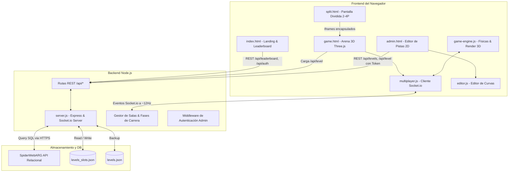
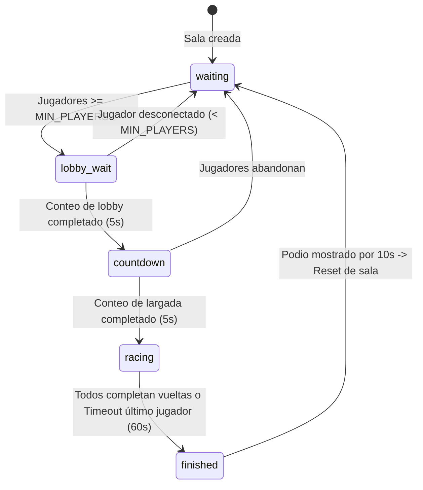

# CONTEXT.md — SpiderKart

> **Documento de Contexto Integral y Arquitectura Técnica**  
> **Proyecto:** SpiderKart (Portal Web & Videojuego 3D de Carreras en Navegador)  
> **Organización / Creadores:** Spider-Web ARG (Franco Calegari & GaboDev24)  
> **Evento de origen:** Underc0de Day (Mendoza, Argentina) & Competencia Comunitaria  
> **Última actualización:** 2026-10-09  

---

## 1. Visión General del Proyecto

**SpiderKart** es una plataforma web y videojuego de carreras de karts en 3D ejecutado nativamente en el navegador sin complementos ni plugins externos. El juego está construido sobre **Three.js (WebGL)**, **JavaScript moderno (ES6+)**, **Node.js (Express & Socket.io)** y se conecta a la infraestructura cloud de **SpiderWebARG** para persistencia relacional.

El proyecto destaca por su identidad estética **táctica/militar-cyberpunk** (HUD dinámico, retículas, scanlines CRT, tipografías monoespaciadas y terminaciones angulares), una simulación de conducción ágil estilo arcade (mecánica de derrape con mini-turbos, combate con misiles teledirigidos, rampas con acrobacias aéreas y atajos tridimensionales), y un ecosistema que soporta:
1. **Carreras individuales (Time Attack):** Cronometraje de precisión, registro de mejores vueltas y subida de puntuaciones al ranking global.
2. **Multijugador en línea (Salas WebSockets):** Servidor integrado con sincronización de telemetría a ~12 Hz, colisiones entre proyectiles, consumo sincronizado de items y podio de posiciones.
3. **Multijugador local en pantalla dividida (Split Screen):** Hasta 4 jugadores en simultáneo en la misma máquina mediante Gamepad API y controles independientes.
4. **Editor de circuitos dinámico (Panel de Administración):** Entorno 2D para diseñar trazados Catmull-Rom, ubicar obstáculos, rampas, items, atajos y gestionar hasta 5 slots de niveles sincronizables con la nube.

---

## 2. Stack Tecnológico

### Frontend
- **Motor 3D:** [Three.js r128](https://threejs.org/) (renderizado WebGL, sombras `PCFSoftShadowMap`, niebla volumétrica exponencial, shaders e iluminación procedural).
- **Lógica de Cliente:** JavaScript Vanilla ES6+ modular sin transpiladores pesados.
- **Renderizado 2D Auxiliar:** HTML5 Canvas API (usado para el minimapa vectorial en tiempo real del HUD y el editor de pistas).
- **Estilos y Maquetación:** CSS3 puro con variables CSS personalizadas, diseño responsive, animaciones aceleradas por hardware y `clip-path` poligonal.
- **Tipografías:**
  - `Barlow Condensed`: Titulares prominentes, velocímetro digital, CTAs.
  - `Share Tech Mono`: HUD del juego, telemetría, código y etiquetas tácticas.
  - `Inter`: Textos descriptivos, formularios y modales.
- **Iconografía:** Font Awesome 6.5.0 (SVG/CSS).
- **Gamepad API:** Soporte nativo para joysticks/mandos físicos (Xbox, PlayStation, genéricos USB/Bluetooth).

### Backend
- **Entorno de Ejecución:** [Node.js](https://nodejs.org/) (versión 18+ recomendada, modo ESM `"type": "module"`).
- **Servidor Web:** [Express 4](https://expressjs.com/) (servidor HTTP, gestión de assets estáticos y API REST).
- **Comunicación en Tiempo Real:** [Socket.io 4](https://socket.io/) (comunicación bidireccional cliente-servidor con fallback a WebSockets estándar).
- **Seguridad y Cifrado:** [bcrypt](https://github.com/kelektiv/node.bcrypt.js) para hashing de contraseñas de pilotos.
- **Variables de Entorno:** [dotenv](https://github.com/motdotla/dotenv).
- **Peticiones HTTP Backend:** [node-fetch](https://github.com/node-fetch/node-fetch) para comunicación con microservicios externos.

### Base de Datos y Almacenamiento
- **Base de Datos Principal:** API Relacional SQL de SpiderWebARG (`https://spiderwebargapi.com.ar/api/v1/query`), protegida por `X-API-KEY`.
- **Almacenamiento Local (Fallback & Slots):**
  - `levels.json`: Circuito activo guardado localmente como respaldo ante fallos de conexión a la API.
  - `levels_slots.json`: Almacén local de slots 2 a 5 para el editor de circuitos.
  - `localStorage` del navegador: Persistencia de sesión de usuario (`spiderkart_username`, `spiderkart_userId`) y configuración de gráficos/resolución (`sk_settings`).

---

## 3. Arquitectura del Sistema



---

## 4. Estructura de Directorios y Archivos

```
SpiderKart/
├── .env                      # Variables de entorno locales (credenciales de API, puerto, token admin)
├── .env.example              # Plantilla documentada de variables de entorno
├── .gitignore                # Archivos ignorados por Git (node_modules, .env, backups)
├── CONTEXT.md                # Este documento: contexto y arquitectura completa
├── DESIGN.md                 # Especificación técnica del Design System y tokens tácticos
├── README.md                 # Documentación introductoria del repositorio
├── init-db.js                # Script CLI para crear las tablas SQL users y leaderboard
├── test-api.js               # Script CLI para probar la conectividad contra SpiderWebARG API
├── test-env.js               # Verificador rápido de variables de entorno
├── update-multiplayer.js     # Script de utilidad para refactorizar multiplayer.js
├── levels.json               # Nivel activo por defecto en formato JSON
├── levels_slots.json         # Repositorio de niveles guardados en slots secundarios (2 a 5)
├── package.json              # Dependencias y scripts de Node.js
├── package-lock.json         # Árbol de dependencias fijadas
├── server.js                 # Servidor principal (Express, WebSocket Socket.io, API REST)
└── public/                   # Raíz de archivos estáticos servidos por Express
    ├── 404.html              # Página de error 404 táctica
    ├── admin.html            # Editor visual de circuitos y panel de control de slots
    ├── game.html             # Arena 3D, HUD, controles táctiles y canvas de Three.js
    ├── index.html            # Portal principal (Landing, Auth modals, Leaderboard en vivo)
    ├── split.html            # Modo pantalla dividida (2, 3 o 4 jugadores locales)
    ├── logo_blanco.ico       # Favicon del proyecto
    ├── css/
    │   ├── index.css         # Estilos específicos de la landing page y componentes de presentación
    │   ├── style.css         # Reset y estilos complementarios
    │   └── tactical.css      # Sistema de diseño táctico (variables, modales, botones, inputs)
    ├── js/
    │   ├── editor.js         # Lógica interactiva del editor 2D (Catmull-Rom, drag/drop, zoom/pan)
    │   ├── game-engine.js    # Motor del juego 3D (~3000 líneas: físicas, colisiones, HUD, cámara)
    │   ├── game-placeholder.js # Módulo auxiliar de compatibilidad
    │   ├── main.js           # Lógica del portal web (Auth, Leaderboard, modales, alertas)
    │   ├── multiplayer.js    # Cliente Socket.io (conexión a salas, replicación de karts fantasma)
    │   └── theme.js          # Script inicial para prevención de FOUC y tema claro/oscuro
    └── img/
        ├── logo para modo claro.png
        └── logo para modo oscuro.png
```

---

## 5. El Motor del Juego (`game-engine.js`)

El archivo `public/js/game-engine.js` conforma el núcleo de renderizado y simulación física del videojuego. Opera a una tasa objetivo de **60 FPS** sincronizada con `requestAnimationFrame`.

### 5.1. Geometría y Trazado de la Pista
1. **Curva 3D Catmull-Rom:**
   - Se alimenta de los puntos de control cargados desde `/api/level` (o `DEFAULT_LEVEL` como fallback).
   - Genera una curva suave cerrada `THREE.CatmullRomCurve3(points, true, 'centripetal', 0.5)`.
   - Precalcula `TRACK_SAMPLES = 800` muestras a lo largo del recorrido conteniendo: posición `(x, y, z)`, tangente unitaria `(tan.x, tan.y, tan.z)`, vector normal perpendicular `(normal.x, normal.z)` y parámetro de longitud normalizada `t` (0.0 a 1.0).
2. **Construcción de la Malla (Mesh):**
   - Calzada asfaltada con relieve central reflectivo.
   - Bordes luminosos con emisividad de color rojo y barreras de contención laterales que delimitan el ancho de pista (`HALF_WIDTH = 14`).
   - Generación de relieve montañoso procedural con filtrado perimetral (`MIN_DIST_FROM_TRACK = 80`) para evitar que las montañas invadan el circuito.

### 5.2. Físicas y Conducción del Kart
- **Aceleración y Freno:**
  - Aceleración lineal con inercia: `ACCEL = 0.007`.
  - Velocidad máxima base: `MAX_SPEED = 1.35`.
  - Frenado y reversa: `BRAKE = 0.012`, reversa limitada a `REVERSE_MAX = -0.35`.
  - Fricción natural por resistencia del aire y suelo: `FRICTION = 0.988`.
- **Dirección Dinámica:**
  - Ángulo de giro: `TURN_SPEED = 0.038`.
  - Respuesta visual en las ruedas delanteras orientables (`wheelRig`).
  - Balanceo de chasis (*body roll*) e inclinación frontal/trasera (*pitch*) ante aceleración y frenadas bruscas.
- **Suspensión y Salto:**
  - Gravedad simulada: `GRAVITY = -0.018`.
  - Salto corto táctico: `JUMP_VEL = 0.16`.

### 5.3. Sistema de Derrape (Drifting) y Mini-Turbo
- **Activación:** Sostener la barra espaciadora (o botón de salto en mando) mientras se realiza un viraje (A/D o joystick).
- **Dinámica:** La fricción lateral disminuye considerablemente, permitiendo cerrar el ángulo mientras el kart mantiene inercia hacia adelante.
- **Carga de Potencia:** Se incrementa una variable `driftPower`.
- **Efectos Visuales:** Las ruedas traseras emiten chispas que transicionan cromáticamente de azul neón (carga baja) a naranja/dorado (carga completa).
- **Mini-Turbo al Salir:** Al soltar el derrape tras un umbral de carga, se otorga una bonificación instantánea de velocidad punta y se encienden las llamas de escape (`flames`).

### 5.4. Detección de Sentido Contrario (Anti-Cheat Vectorial)
- **Cálculo:** Para cada fotograma, se calcula el producto escalar (*dot product*) entre el vector unitario de dirección del kart y la tangente `tan` del trazado más próximo:
  $$\text{dot} = \cos(\theta) \cdot \text{tan}_x + \sin(\theta) \cdot \text{tan}_z$$
- **Comportamiento:** Si $\text{dot} < -0.2$, se considera sentido inverso. Si se mantiene por más de un umbral temporal:
  - Se activa la alerta parpadeante en pantalla: `"¡SENTIDO CONTRARIO!"`.
  - Se bloquea el progreso de checkpoints y se impide la validación de nuevas vueltas hasta retomar el rumbo correcto.

### 5.5. Rampas, Acrobacias Aéreas y Atajos
- **Rampas 3D:** Geometrías de cuña elevadas sobre la pista. Al ser abordadas a gran velocidad, lanzan el kart al aire.
- **Acrobacias (Stunts):** Durante el vuelo sobre rampas, el kart ejecuta rotaciones coordinadas (`roll`, `pitch`, `yaw`) acompañadas de una estela de partículas de colores (cian, oro, magenta, verde neón). Al aterrizar con éxito, libera una onda expansiva en el suelo y concede un turbo inmediato.
- **Atajos Tridimensionales:** Trazados secundarios curvos con rampas de entrada y salida elevadas. Cuentan con validación de altura tridimensional para evitar atravesar túneles o falsos solapamientos de pista.
- **Detector Fuera de Pista (Off-road):** Si el kart se aleja excesivamente de la calzada principal o atajos válidos, se reduce drásticamente su velocidad y se despliega una advertencia en el HUD.

### 5.6. Sistema de Items y Combate
- **Orbes / Cajas de Items en Pista:**
  1. `missile` (Verde): Misil balístico frontal recto.
  2. `homing` (Rojo): Misil teledirigido que rastrea rivales y obstáculos en un cono de 60°.
  3. `boost` (Amarillo): Turbo inmediato adicional.
- **Inventario:** Hasta 3 proyectiles almacenados en los slots del HUD. Disparo con tecla `E`.
- **Impacto y Trompo:** Al impactar un misil contra un kart (local o remoto), este entra en estado de trompo durante 1.5 segundos (`spinOutTimer`), perdiendo velocidad con giro de 360°, seguido de un período de invulnerabilidad temporal.
- **Obstáculos Destructibles:** Los misiles pueden detonar obstáculos en pista (barriles, cristales o huevos alienígenas), los cuales explotan en partículas y reaparecen a los 7 segundos.

### 5.7. Cronómetro y Checkpoints
- Una serie de checkpoints invisibles equidistantes obligan al corredor a seguir el circuito sin cortar pista.
- Mide:
  - **Tiempo total de carrera** (formato `MM:SS.mmm`).
  - **Tiempo de vuelta en curso**.
  - **Mejor vuelta personal** (`Best Lap`).
- Anuncio dinámico de vuelta (`showLapAnnounce`) y aviso especial de `"¡ÚLTIMA VUELTA!"`.

---

## 6. Arquitectura Multijugador y WebSockets

La capa en red está orquestada en `server.js` mediante **Socket.io** y consumida por `public/js/multiplayer.js`.

### 6.1. Ciclo de Vida de una Sala (Room State Machine)



### 6.2. Protocolo de Mensajes JSON

#### Cliente $\to$ Servidor
| Evento / Type | Parámetros | Descripción |
|---|---|---|
| `join` | `{ room, name, pilotId }` | Petición para ingresar a una sala determinada. |
| `state` | `{ x, y, z, angle, speed, boosting, lap }` | Telemetría continua enviada a frecuencia controlada (~12 Hz). |
| `hit` | `{ targetId }` | Notificación de impacto de un misil sobre un rival específico. |
| `consume_powerup` | `{ powerupIdx }` | Avisa que un item en pista fue recogido para desaparecerlo en los demás clientes. |
| `finish` | `{ timeMs, lap }` | Notificación de llegada a meta con tiempo final cronometrado. |
| `leave` | `{}` | Salida voluntaria de la sala actual. |

#### Servidor $\to$ Cliente
| Evento / Type | Parámetros | Descripción |
|---|---|---|
| `joined` | `{ room, playerId, players: [...] }` | Confirmación de entrada y lista de pilotos presentes con color asignado. |
| `player_joined` | `{ id, name, color }` | Difusión de la llegada de un nuevo competidor. |
| `player_left` | `{ id }` | Desconexión de un competidor. |
| `waiting` | `{ count, min }` | Notificación de espera por jugadores mínimos (por defecto 2). |
| `lobby_wait` | `{ seconds }` | Conteo previo al despliegue en la grilla. |
| `countdown` | `{ seconds, players: [{id, startPosition}] }` | Conteo de largada (5 a 1) y asignación de puestos escalonados en la grilla. |
| `race_start` | `{ laps }` | Señal de salida coordinada (`¡YA!`), desbloquea los controles. |
| `state` | `{ id, x, y, z, angle, speed, boosting, lap }` | Retransmisión de la posición de cada rival. |
| `hit` | `{ targetId, sourceId }` | Notificación a todos para inducir el trompo en el rival alcanzado. |
| `powerup_consumed` | `{ powerupIdx, consumedBy }` | Desactiva el item indicado en la vista de los demás corredores. |
| `last_player` | `{ id, name }` | Activa cuenta regresiva de 60s al último corredor rezagado. |
| `race_results` | `{ results: [{id, name, timeMs, position}], saved }` | Tabla de clasificación final de la partida. |
| `error` | `{ message }` | Informa que la sala está llena (máx. 6) o la carrera ya inició. |

---

## 7. Editor de Niveles y Panel de Administración (`/admin`)

El editor permite modelar circuitos completos desde el navegador sin necesidad de herramientas externas tipo Blender.

### 7.1. Características del Editor (`editor.js` & `admin.html`)
- **Autenticación:** Requiere `ADMIN_TOKEN` (definido en `.env`). Se valida mediante `POST /api/admin/login` o header `x-admin-token`.
- **Canvas 2D Interactivo:**
  - Modos de edición: Agregar, mover y borrar puntos de control de la pista.
  - Curva de preview Catmull-Rom trazada en tiempo real.
  - Colocación y edición de:
    - **Obstáculos** (barriles, cristales, huevos alienígenas) con carril (*lane*) y muestra de pista (*sampleIdx*).
    - **Rampas** de salto con orientación y escala.
    - **Power-ups** (misil verde, teledirigido rojo, turbo amarillo).
    - **Atajos (Shortcuts)** con puntos de entrada, salida y elevación 3D.
    - **Nodos de terreno y relieve**.
    - **Barreras físicas de contención**.
- **Gestor de 5 Slots de Circuitos:**
  - **Slot 1 (Activo):** Sincronizado bidireccionalmente con la base de datos `spiderkart_levels` y respaldado en `levels.json`.
  - **Slots 2 al 5:** Almacenados en `levels_slots.json` para tener circuitos de prueba o variantes.
  - **Activación en caliente (`/api/level/activate`):** Al activar un slot, el servidor notifica vía socket (`level_changed`) a todos los clientes conectados para recargar la pista instantáneamente.
- **Herramientas de Diseño:**
  - Historial de cambios Deshacer/Rehacer (*Undo/Redo*) con hasta 60 estados en memoria.
  - Zoom con rueda del ratón y paneo arrastrando con barra espaciadora.
  - Carga de imágenes de fondo (bocetos de circuitos o planos) con ajuste de escala y opacidad.

---

## 8. Pantalla Dividida (Split Screen - `split.html`)

Diseñada para eventos presenciales, arcades y juego cooperativo o competitivo en el mismo ordenador.

- **Modos:** 2, 3 o 4 jugadores.
- **Layout Inteligente:**
  - 2 Jugadores: 2 columnas verticales (`grid-template-columns: 1fr 1fr`).
  - 3 Jugadores: El jugador 1 ocupa la fila superior completa, jugadores 2 y 3 se dividen la inferior.
  - 4 Jugadores: Cuadrícula simétrica 2x2.
- **Aislamiento Técnico:** Cada cuadrícula carga una instancia de `game.html?splitMode=1` dentro de un `<iframe>`.
- **Mapeo de Mandos (Gamepad API):**
  - Detección automática de controles conectados mediante `window.addEventListener('gamepadconnected')`.
  - Panel de asignación en el lobby: asigna qué mando físico (o teclado) controla al Jugador 1, 2, 3 y 4.
  - Comunicación a través de `postMessage` entre la ventana padre (`split.html`) y los iframes hijos para transmitir los estados de acelerador, freno, giro, derrape y disparo con latencia nula.

---

## 9. API REST y Esquema de Base de Datos

### 9.1. Endpoints HTTP

| Método | Endpoint | Acceso | Descripción |
|---|---|---|---|
| `GET` | `/admin` | Público | Sirve la interfaz web del editor de niveles. |
| `POST` | `/api/admin/login` | Público | Valida el token de administrador. |
| `GET` | `/api/level` | Público | Retorna el nivel activo en formato JSON (query opcional `?slot=1..5`). |
| `POST` | `/api/level` | Admin | Guarda las modificaciones de un nivel (query `?slot=1..5`). |
| `GET` | `/api/levels` | Admin | Lista el estado de los 5 slots disponibles. |
| `POST` | `/api/level/activate`| Admin | Convierte un slot específico en el nivel activo de la arena. |
| `GET` | `/api/rooms` | Público | Retorna el listado de salas multijugador activas, anfitriones y fases. |
| `GET` | `/api/leaderboard` | Público | Retorna el Top 10 de mejores puntuaciones históricas. |
| `POST` | `/api/leaderboard` | Público | Registra una nueva puntuación vinculada a un `userId`. |
| `POST` | `/api/auth/register` | Público | Registra una cuenta nueva con usuario, correo y contraseña. |
| `POST` | `/api/auth/quick-register`| Público | Registro instantáneo o login automático mediante correo. |
| `POST` | `/api/auth/login` | Público | Autenticación con verificación de hash bcrypt. |
| `GET` | `/api/init-db` | Público | Inicializa las tablas de la base de datos si no existen. |

### 9.2. Esquemas de Tablas SQL

```sql
-- Tabla de Pilotos Registrados
CREATE TABLE IF NOT EXISTS users (
    id INT AUTO_INCREMENT PRIMARY KEY,
    username VARCHAR(50) UNIQUE NOT NULL,
    email VARCHAR(100) UNIQUE,
    password_hash VARCHAR(255) NOT NULL,
    created_at TIMESTAMP DEFAULT CURRENT_TIMESTAMP
);

-- Tabla de Puntuaciones y Clasificación
CREATE TABLE IF NOT EXISTS leaderboard (
    id INT AUTO_INCREMENT PRIMARY KEY,
    user_id INT,
    score INT NOT NULL,
    recorded_at TIMESTAMP DEFAULT CURRENT_TIMESTAMP,
    FOREIGN KEY (user_id) REFERENCES users(id)
);

-- Tabla de Persistencia de Circuitos en la Nube
CREATE TABLE IF NOT EXISTS spiderkart_levels (
    id INT AUTO_INCREMENT PRIMARY KEY,
    level_json TEXT NOT NULL,
    updated_at TIMESTAMP DEFAULT CURRENT_TIMESTAMP ON UPDATE CURRENT_TIMESTAMP
);
```

---

## 10. Sistema de Diseño (Design System Táctico)

SpiderKart comparte el sistema de diseño visual con la suite de herramientas **SpiderWebARG**:

- **Paleta de Colores Primaria:**
  - Fondo Absoluto: `#000000` / `#050505` (Deep Black)
  - Superficies de Tarjetas / HUD: `rgba(18, 18, 30, 0.75)` con desenfoque de fondo (*backdrop blur*).
  - Acento Principal: `#a30000` (Rojo Táctico SpiderWeb).
  - Glow y Fuego: `#ff2200`, `#ff6600`.
  - Acentos de Telemetría: `#00ff66` (Verde misil / Éxito), `#00d4ff` (Cian escudo / Turbo), `#ffcc00` (Ámbar alerta).
- **Tratamiento Geométrico:**
  - Recorte de esquinas mediante `clip-path: polygon(0 0, calc(100% - 10px) 0, 100% 10px, 100% 100%, 10px 100%, 0 calc(100% - 10px))`.
  - Retículas angulares en las cuatro esquinas de paneles tácticos (`hud-corner`).
  - Líneas de escaneo CRT sutiles (`sw-scanlines`) y textura de ruido superpuesta (`noise-overlay`).

---

## 11. Controles del Juego

| Acción | Teclado Principal | Teclas Alternativas | Mando / Gamepad |
|---|---|---|---|
| **Acelerar** | `W` | `Flecha Arriba` | Gatillo Derecho (`RT` / `R2`) o Botón `A` / `Cruz` |
| **Frenar / Reversa** | `S` | `Flecha Abajo` | Gatillo Izquierdo (`LT` / `L2`) o Botón `B` / `Círculo` |
| **Girar a la Izquierda** | `A` | `Flecha Izquierda` | Stick Izquierdo (Izquierda) / D-Pad Izq |
| **Girar a la Derecha** | `D` | `Flecha Derecha` | Stick Izquierdo (Derecha) / D-Pad Der |
| **Salto / Derrape (Drift)**| `Barra Espaciadora`| - | Botón Superior (`RB` / `R1`) o Botón `X` |
| **Disparar Misil** | `E` | - | Botón `Y` / `Triángulo` |
| **Activar Nitro / Turbo** | `K` | `Shift Izquierdo` | Botón `LB` / `L1` |
| **Pausa / Menú** | `Escape` | - | Botón `Start` / `Options` |

---

## 12. Puesta en Marcha y Entorno de Desarrollo

### 12.1. Requisitos Previos
- **Node.js** v18.0.0 o superior.
- **npm** v9 o superior.
- Navegador moderno con soporte para **WebGL 2.0** y **WebSockets**.

### 12.2. Configuración de Variables de Entorno
Crear un archivo `.env` en la raíz del proyecto basándose en `.env.example`:
```env
PORT=3000
spiderapikey="tu_clave_api_spiderweb"
spiderdbname="tu_nombre_de_base_de_datos"
spidercloudstorageid="tu_id_de_almacenamiento"
ADMIN_TOKEN="token_secreto_para_el_editor"
```

### 12.3. Instalación e Inicialización
```bash
# 1. Instalar dependencias
npm install

# 2. Inicializar tablas en la base de datos remota
node init-db.js

# 3. Probar la conexión con la API
node test-api.js
```

### 12.4. Ejecución del Servidor
```bash
# Modo Producción
npm start

# Modo Desarrollo (con recarga automática de servidor)
npm run dev
```

El servidor estará disponible en `http://localhost:3000`.

---

## 13. Rutas y Accesos Directos Clave
- **Portal Principal / Ranking:** `http://localhost:3000/`
- **Arena 3D (Pantalla Completa):** `http://localhost:3000/game.html`
- **Modo Pantalla Dividida (2-4P):** `http://localhost:3000/split.html`
- **Editor de Niveles (Admin):** `http://localhost:3000/admin`
- **Modo Debug / Carrera Individual:** `http://localhost:3000/game.html?debug=1`

---

## 14. Historial de Decisiones Técnicas y Gotchas

1. **Interpolación de Karts Fantasma:**  
   Para evitar tirones en las partidas multijugador bajo conexiones con jitter, `multiplayer.js` realiza interpolación lineal (`lerp`) sobre los vectores de posición y rotación de los karts remotos, proyectando la orientación según la velocidad reportada.
2. **Elevación de Atajos y Prevención de Colisiones Falsas:**  
   En las pistas con relieve y atajos elevados, se corrigió un bug histórico donde los karts detectaban colisiones con el suelo inferior al sobrevolar un puente. El motor ahora compara tanto la distancia 2D al eje central como la diferencia de altura vertical relativa ($\Delta y$), evitando caídas o teletransportes erróneos.
3. **Persistencia Dual (Cloud First con Fallback Local):**  
   Si la API de SpiderWebARG no responde o hay problemas de red durante un evento presencial, el servidor cambia automáticamente al modo fallback, sirviendo y guardando el nivel activo en `levels.json` sin interrumpir la partida.
4. **Protección Contra FOUC (*Flash of Unstyled Content*):**  
   `public/js/theme.js` se ejecuta de forma síncrona en el `<head>` de todas las páginas antes del renderizado del DOM para leer la preferencia de color/tema y aplicar la clase CSS correspondiente sin parpadeos.
5. **Aislamiento en Pantalla Dividida:**  
   El uso de iframes independientes para cada cuadrícula en `split.html` permite que cada instancia de Three.js gestione su propio contexto WebGL, cámara y bucle de renderizado sin mezclar estados internos de físicas ni identificadores de sonido.

---

## 15. Deploy en Vercel

### 15.1. Arquitectura de Producción Recomendada

Vercel es una plataforma **serverless**: no admite procesos Node.js persistentes ni conexiones WebSocket de larga duración. Por este motivo, el despliegue completo de SpiderKart requiere **dos servicios**:

```
┌──────────────────────────────────────────────────────┐
│                       VERCEL                         │
│  ─ CDN global para archivos estáticos                │
│  ─ Función serverless: /api/* (REST)                 │
│  ─ Sin Socket.io (serverless ≠ proceso persistente)  │
└──────────────┬───────────────────────────────────────┘
               │ HTTPS (REST)
               ▼
┌──────────────────────────────────────────────────────┐
│          SpiderWebARG API (DB Relacional)             │
│  ─ Tabla users                                       │
│  ─ Tabla leaderboard                                 │
│  ─ Tabla spiderkart_levels                           │
│  ─ Tabla spiderkart_level_slots (nueva en Vercel)    │
└──────────────────────────────────────────────────────┘

┌──────────────────────────────────────────────────────┐
│   SERVIDOR WS DEDICADO (Railway / Render / Fly.io)   │
│  ─ Ejecuta server.js original completo               │
│  ─ Socket.io: salas, telemetría, colisiones, podio   │
│  ─ Mismos WS events que el protocolo documentado     │
└──────────────────────────────────────────────────────┘
       ▲ WebSocket (wss://)
       │
┌──────┴───────────────────────────────────────────────┐
│          Navegador del Jugador                        │
│  ─ Carga assets desde Vercel CDN                     │
│  ─ REST API → Vercel /api/*                          │
│  ─ WebSocket (multiplayer) → Servidor dedicado       │
└──────────────────────────────────────────────────────┘
```

### 15.2. Qué funciona en Vercel

| Funcionalidad | Vercel (Serverless) | Servidor Dedicado |
|---|:---:|:---:|
| Portal Web / Landing | ✅ | ✅ |
| Arena 3D (modo individual) | ✅ | ✅ |
| Pantalla Dividida (local) | ✅ | ✅ |
| Autenticación (registro/login) | ✅ | ✅ |
| Leaderboard en tiempo real | ✅ | ✅ |
| Editor de Pistas (Admin) | ✅ | ✅ |
| Persistencia de Niveles en DB | ✅ | ✅ |
| **Multijugador en línea (WebSockets)** | ❌ | ✅ |
| Escritura a disco (`levels.json`) | ❌ | ✅ |
| In-memory rooms / estado de carrera | ❌ | ✅ |

### 15.3. Archivos Específicos para Vercel

| Archivo | Descripción |
|---|---|
| [`vercel.json`](vercel.json) | Configuración principal: rutas, build y source map |
| [`api/index.js`](api/index.js) | Handler Express serverless sin Socket.io ni escritura a disco. Slot de niveles 2–5 migrados a tabla `spiderkart_level_slots` en la DB |

### 15.4. Pasos de Deploy

#### Paso 1: Deploy del Servidor WebSocket (para multijugador)

> **Omitir este paso** si solo querés el modo individual/local.

Despliega `server.js` original en Railway, Render o Fly.io:

```bash
# Railway (ejemplo)
railway init
railway up

# Render: Conectar repositorio → Web Service → Start Command: npm start

# Fly.io
fly launch
fly deploy
```

Anota la URL pública del servidor (ej.: `https://spiderkart-ws.railway.app`).

#### Paso 2: Variables de Entorno en Vercel

En el dashboard de Vercel → **Settings → Environment Variables**, agrega:

| Variable | Valor | Descripción |
|---|---|---|
| `spiderapikey` | `tu_api_key` | Clave API de SpiderWebARG |
| `spiderdbname` | `tu_db` | Nombre de la base de datos |
| `ADMIN_TOKEN` | `token_secreto` | Token para el editor de niveles |
| `SPIDERKART_WS_URL` | `https://tu-servidor-ws.railway.app` | URL del servidor WebSocket (opcional, solo si desplegaste Paso 1) |

#### Paso 3: Deploy en Vercel

```bash
# Opción A: Via CLI
npm i -g vercel
vercel --prod

# Opción B: Conectar el repo de GitHub/GitLab en el dashboard de Vercel
# → Importar repositorio → Framework: Other → Build Command: (vacío) → Output: public
```

#### Paso 4: Inicializar las tablas en la DB (solo primera vez)

Abre en el navegador:
```
https://tu-app.vercel.app/api/init-db
```

Esto crea las tablas `users`, `leaderboard`, `spiderkart_levels` y `spiderkart_level_slots`.

### 15.5. Diferencias de Comportamiento en Producción Vercel

1. **Escritura a disco eliminada:** Los slots 2–5 del editor se persisten en la tabla `spiderkart_level_slots` en lugar de `levels_slots.json`. El slot activo sigue en `spiderkart_levels`.
2. **`/api/rooms` retorna lista vacía** con nota explicativa — las salas en memoria no existen en serverless.
3. **Notificación `level_changed` via Socket.io** no funciona desde Vercel. Los clientes del editor verán el cambio al recargar manualmente.
4. **Sin fallback a disco** si la DB está caída: el nivel retornará el `DEFAULT_LEVEL` hardcodeado directamente.
5. **Timeout de función serverless:** Vercel tiene un límite de 10s (Hobby) / 60s (Pro) por función. Las queries a SpiderWebARG deben responder en ese tiempo.

### 15.6. Resolución de Problemas

| Síntoma | Causa probable | Solución |
|---|---|---|
| `/api/level` retorna `DEFAULT_LEVEL` | DB no inicializada o error de credenciales | Abrir `/api/init-db` y verificar variables de entorno |
| Multijugador no conecta | Vercel no expone WebSockets | Desplegar `server.js` en Railway/Render y configurar `SPIDERKART_WS_URL` |
| Error 401 en el editor `/admin` | `ADMIN_TOKEN` no configurado en Vercel | Agregar la variable de entorno `ADMIN_TOKEN` |
| Slots 2–5 del editor vacíos | La tabla `spiderkart_level_slots` no existe | Llamar a `/api/init-db` nuevamente |
| Timeout en funciones serverless | Query a SpiderWebARG lenta | Verificar conectividad a `spiderwebargapi.com.ar` desde los servidores de Vercel |

